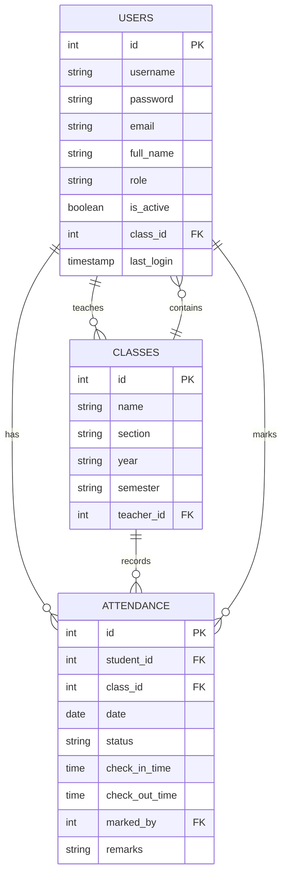

# Entity Relationship Diagram

This diagram documents the database structure used by the running dashboard flow.

```mermaid
erDiagram
    USERS {
        int id PK
        string username
        string password
        string email
        string full_name
        string role
        boolean is_active
        int class_id FK
        timestamp last_login
    }

    CLASSES {
        int id PK
        string name
        string section
        string year
        string semester
        int teacher_id FK
    }

    ATTENDANCE {
        int id PK
        int student_id FK
        int class_id FK
        date date
        string status
        time check_in_time
        time check_out_time
        int marked_by FK
        string remarks
    }

    USERS ||--o{ CLASSES : teaches
    CLASSES ||--o{ USERS : contains
    USERS ||--o{ ATTENDANCE : has
    CLASSES ||--o{ ATTENDANCE : records
    USERS ||--o{ ATTENDANCE : marks
```

The schema DDL lives in `database/schema.sql`.
